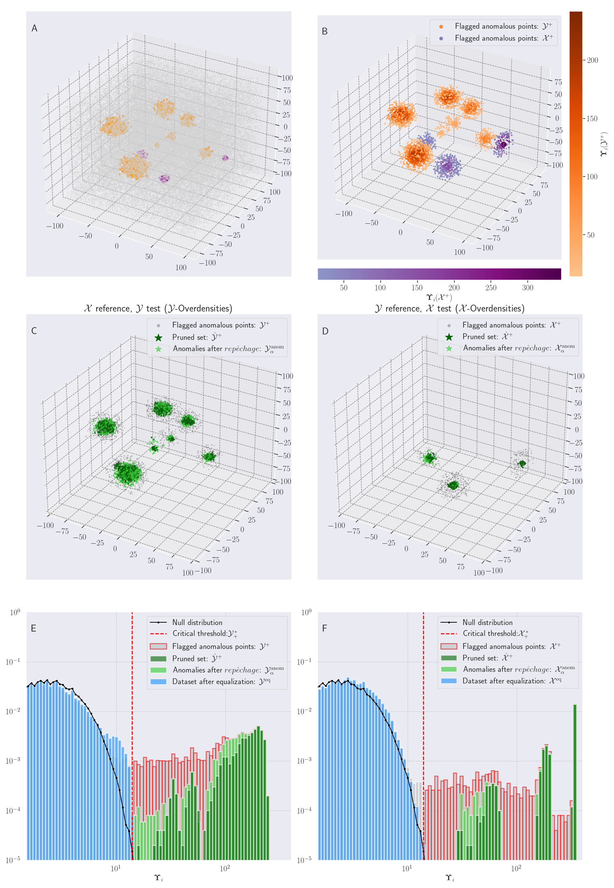
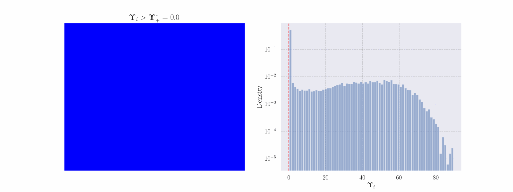
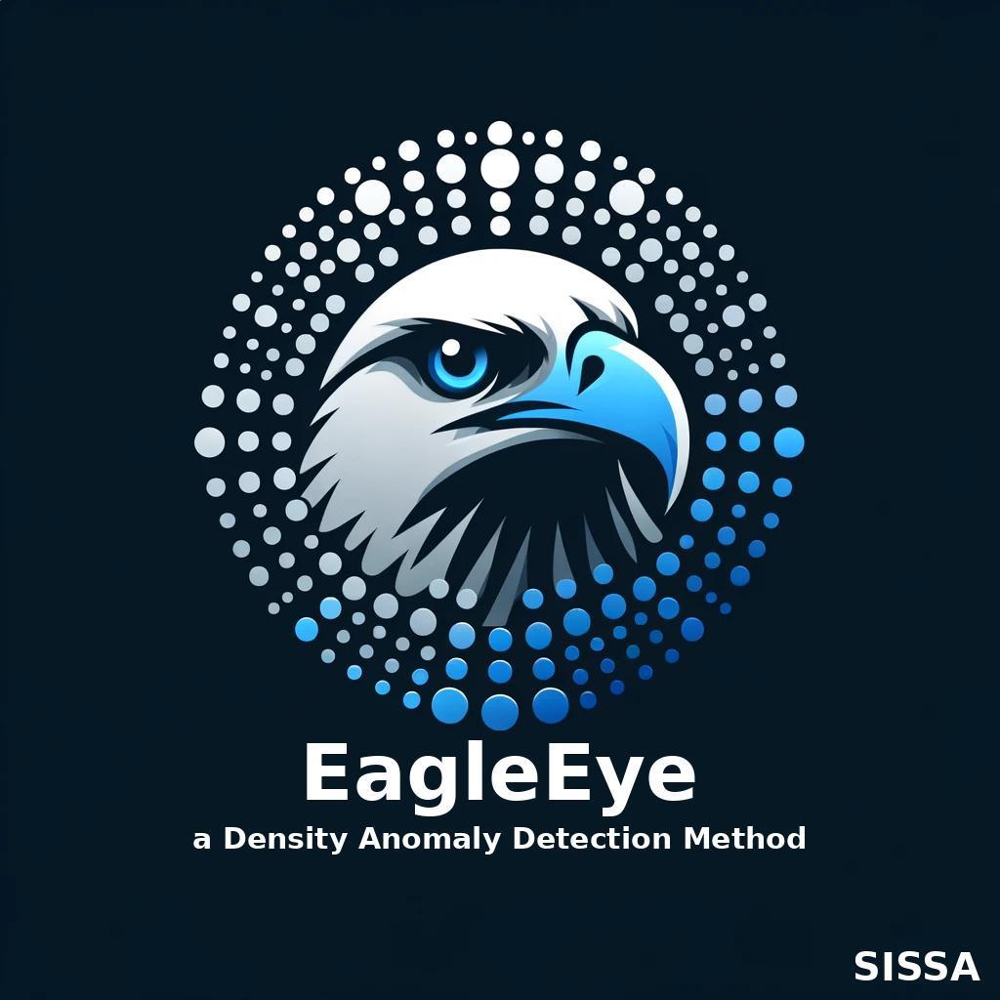

# `EagleEye`: A general purpose density anomaly detection method

<small>
Above: Multimodal over-densities (red) and under-densities (purple) captured by $\texttt{EagleEye}$. 
</small>

**EagleEye** is a novel, density-based anomaly detection method designed for comparing two datasets to identify deviations in the test dataset. By analyzing the local neighborhood of each point in the test set, EagleEye detects subtle density anomalies without making any assumptions about the underlying data distribution.

EagleEye has several key features:
- **Distribution-free**: Works without assuming a specific data distribution.
- **Easy to interpret**: Based on intuitive concepts like flipping a coin.
- **Reproducible**: Guarantees consistent results across multiple runs.
- **Efficient and scalable**: Suitable for large datasets and can be parallelized for faster computation.
- **Signal-purity estimation**: Once density anomalies are observed, can compute estimates of the 'signal purity' _per local density annomaly_ in a completely unsupervised fashion.

## Examples
The `examples/` directory contains code to regenerate the figures from the main text and supplementary information of the paper. 

## Licensing

EagleEye is available under a dual licensing model:

- **Non-Commercial Academic and Research License (NCARL) v1.0**: Free for academic research, educational purposes, and personal non-commercial projects.
- **Commercial License Agreement (CLA) v1.0**: Required for commercial use.

### Non-Commercial Use

For non-commercial use, see the [Non-Commercial Academic and Research License](NON-COMMERCIAL-LICENSE.md).

### Commercial Use

For commercial use, please see the [Commercial License Agreement](COMMERCIAL-LICENSE.md).

## Acknowledgment

If you use EagleEye in your publications please include an propriate citation to the article linked with tis repository. For products, please include the following acknowledgment:
- "This software uses EagleEye developed by Sebastian Springer et al. at the International School for Advanced Studies (SISSA), Via Bonomea, 265, 34136 Trieste TS (Italy)."

## Disclaimer

The software is provided "as-is" without any warranty of any kind.

