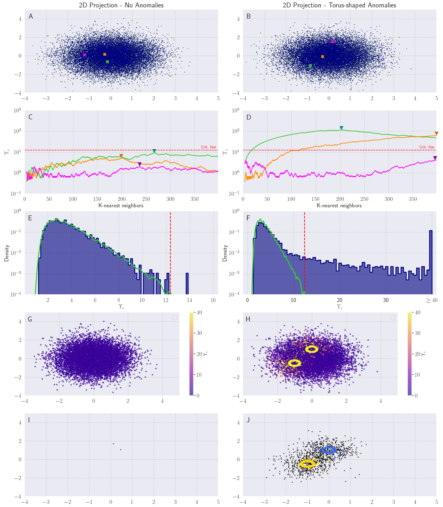

# `EagleEye`: A general purpose density anomaly detection method

<small>
Above: Toroidal anomalies are captured in 10-dimensional gaussian data by `EagleEye`. 
</small>

**EagleEye** is a novel, density-based anomaly detection method designed for comparing two datasets to identify deviations in the test dataset. By analyzing the local neighborhood of each point in the test set, EagleEye detects subtle density anomalies without making any assumptions about the underlying data distribution.

EagleEye has several key features:
- **Distribution-free**: Works without assuming a specific data distribution.
- **Easy to interpret**: Based on intuitive concepts like flipping a coin.
- **Reproducible**: Guarantees consistent results across multiple runs.
- **Efficient and scalable**: Suitable for large datasets and can be parallelized for faster computation.

## Examples
The `examples/` directory contains code to regenerate the figures from the main text and supplementary information of the paper. 
