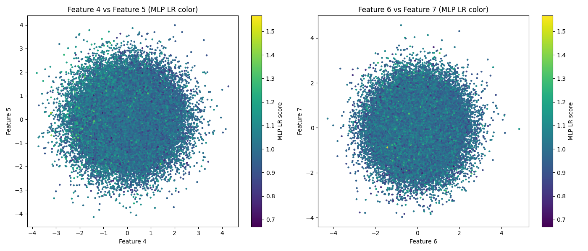
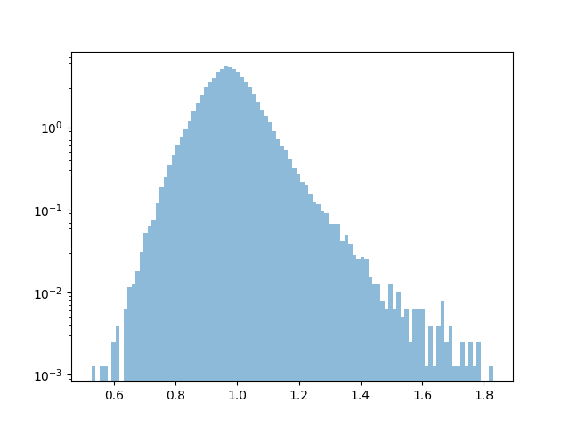

# Comparing EagleEye and Various Two-Sample Tests

In `2samp_tests.ipynb`, we provide a few examples to demonstrate where one would like to use EE instead of an MLP, BDT, wavelet, or vanilla kNN classifier. 

---

## How Are MLP Classifiers Supposed to Work in This Case?   

Optimising binary cross-entropy minimises:  

%20=%20-\mathbb{E}_{x\sim%20p_{\rm%20bg}}[\log(1%20-%20f(x))]%20-%20\mathbb{E}_{x\sim%20p_{\rm%20data}}[\log%20f(x)])

Assuming the universal approximation holds for the NN $f$, the optimal solution is:

$$
f(x) = \Pr(Y=1 \mid x) = \frac{\pi_1\,p_{\mathrm{data}}(x)}{\pi_0\,p_{\mathrm{bg}}(x) + \pi_1\,p_{\mathrm{data}}(x)}
$$

Assuming equal priors:

$$
\Rightarrow \mathcal{L}(x) \sim \frac{p_{\mathrm{data}}(x)}{p_{\mathrm{bg}}(x)}
$$

If the data is a mixture of signal and background, the real data distribution is:

$$
p_{\mathrm{data}}(x) = (1 - \varepsilon) p_{\mathrm{bg}}(x) + \varepsilon p_{\mathrm{sig}}(x)
$$

The true density ratio is:

$$
r(x) = \frac{p_{\mathrm{data}}(x)}{p_{\mathrm{bg}}(x)} = 1 - \varepsilon + \varepsilon \frac{p_{\mathrm{sig}}(x)}{p_{\mathrm{bg}}(x)}
$$

and is used as the anomaly detection threshold.

---

In this example case, we have $\varepsilon \ll 1$ and the following distributions:

* **Background** ($y=0$)  
  $$p_{\mathrm{bg}}(x) = \mathcal{N}(0, I_d)$$  

* **Signal** ($y=1$)  
  $$p_{\mathrm{sig}}(x) = \mathcal{N}(0, \sigma^{2}I_d), \quad \sigma = 0.05$$  

Recall (substituting $B$ into $A$):

$$
\Pr(Y=1 \mid x) = \frac{\varepsilon\,p_{\mathrm{sig}}(x)}{(1 - \varepsilon) p_{\mathrm{bg}}(x) + \varepsilon\,p_{\mathrm{sig}}(x)}
$$

For the centred Gaussians the only difference at $x=0$ is the normalisation constant because the background follows a standard normal:

$$
p_{\mathrm{bg}}(0) = \frac{1}{(2\pi)^{d/2}}, \quad
p_{\mathrm{sig}}(0) = \frac{1}{(2\pi\sigma^{2})^{d/2}} = \sigma^{-d} p_{\mathrm{bg}}(0)
$$

where $d$ is the number of dimensions (here $d = 20$).

So:

$$
\frac{p_{\mathrm{sig}}(0)}{p_{\mathrm{bg}}(0)} = \sigma^{-d}
$$

Insert into the previous expression to obtain the posterior at the origin:

$$
f^T(0) \sim \Pr(Y=1 \mid x=0) = \frac{\varepsilon\,\sigma^{-d}}{(1 - \varepsilon) + \varepsilon\,\sigma^{-d}} = \frac{\varepsilon / \sigma^d}{1 - \varepsilon + \varepsilon / \sigma^d}
$$

This $\to 1$ as $d \to \infty$, as expected for a very concentrated anomaly.

---

## Vanishing-Gradient Effect  

The above will break down when an anomalous overdensity is represented by a very small number of points, swamped by a very large background. 

With a batch of size $B$, the gradient step on a parameter vector $w$ is:

$$
\Delta w = -\eta \frac{1}{B} \sum_{j=1}^B \left[f(x_j; w) - y_j\right] \frac{\partial z_j}{\partial w}
$$

where $f = \text{sigmoid}(x)$ is the NN prediction and $\eta$ is the learning rate.  
For batch sizes of, say, $B=128$, we will very rarely draw a point with label $y=1$ since, for a 20D Gaussian, the probability of getting a point within $\sigma = 0.05$ is:

$$
p \approx 10^{-36}
$$

As a result, the sum will have very few contributions from points with $y=1$. Therefore, for weights whose $\partial z / \partial w$ is non-zero only inside this region, the per-batch gradient is very close to $0$ unless the batch happens to include at least one sample from $R$.

Even when such a sample appears, $|f - y| \leq 1$, so the contribution to the update is bounded by $\eta / B$.

Hence:

$$
\mathbb{E}[\|\Delta w\|] \lesssim \eta\,\sigma^d
$$

which for $d=20$ is astronomically smaller than the typical $O(\eta)$ updates for weights driven by the bulk of the data.

---

## 20-D Gaussian With Concentrated Density Anomaly at the Origin – "Needle in a Haystack"

Here we consider a 20D Gaussian with another very tight Gaussian at the origin representing the signal ($n_{\mathrm{sig}} \sim 100$ points). 

The reference set contains 100k background points and the test set has the other 100k plus the 100 signals.

```python
d      = 20
n_bg   = 200_000
n_sig  = 100         

X_bg   = np.random.randn(n_bg, d)
X_sig  = np.random.randn(n_sig, d) * sigma   # much tighter

# labels: 0 = background, 1 = signal 
X_data = np.vstack([X_bg[:len(X_bg)//2], X_sig])
labels = np.hstack([np.zeros(len(X_bg)//2), np.ones(n_sig)])
X_ref  = X_bg[len(X_bg)//2:]
```


## EagleEyE Results 
TIME TAKEN TO RUN Macbook M1 (Putative + IDE pruning): **1m 1.2s**

-----------
EagleEye sees $\sim100$% of anomolous points within the pruned set ($p_\text{ext}= 10^{-5} \rightarrow \Upsilon^*_+ \sim 38$)


Clearly an anomaly...needs pruning tho!

Also inspect the faction of all points above $\Upsilon_+$ as a function of  $\Upsilon_+$ for both putative and pruned sets: Pruning recovers basically all points contributing to anomolous density. 


<p align="center">
  
  
</p>


ROC curve: AUC = 0.9999719 (Using true labels)


## MLP Results 

##### MLP trained to classify bkg vs data (not signal) estimates the likelihood ratio: 

------------

TIME TAKEN TO RUN macbook M1 GPU: **5m 16.2s**

The neural network of course requires extensive hyperparameter tuning, as opposed to a kNN based method like EagleEye that is deterministic and works out of the box. 

- **Input:**  
  - Concatenated reference and data samples, each with `d=20` features.

- **Network Architecture:**  
  - **Input layer:** Shape = number of features (`d=20`)
  - **Hidden layers:** 3 fully connected layers with 64 units each, ReLU activation:
    - Dense(64, activation="relu")
    - Dense(64, activation="relu")
    - Dense(64, activation="relu")
  - **Output layer:**  
    - Dense(1, activation="sigmoid")  

- **Training:**  
  - **Loss:** Binary cross-entropy
  - **Optimizer:** Adam (learning rate = 1e-3)

  - **Validation split:** 20% of training data
  - **Epochs:** 30 (with early stopping)
  - **Batch size:** 128


-----------
Results in some feature space slices - we see that no anomalous points are recovered:




Distribution of the likelihood ratio estimate




...and the roc curve - not sure whats happening here. Still debugging

ROC curve: AUC = 0.7782 (Using true labels)


